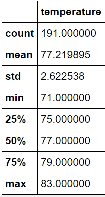
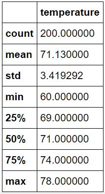

# surfs_up Challenge

## Overview of the analysis:

The following analysis is for a surf and ice cream shop. The purpose is to analysis temperature data from the months of June and December in Oahu in order to determine if business is sustainable year-round.

## Results:

The two deliverables are an analysis of June and December temperature data. The following are three major points from this analysis.

- The data shows relatively similar temperature both in winter and in summer, supporting a viable business in the coldest and hottest temperature.

- Below are the June Summary Data:

 

- Below are the December Summary Data:

 

## Summary:

Overall, the data support a sustainable business year-round. While this data supports the business venture, additional exploration of the data through other queries - like monthly precipitation and wind patterns - could be helpful in supporting (or giving pause) to this venture.
